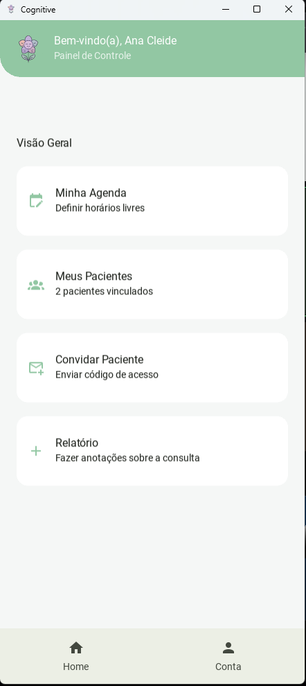
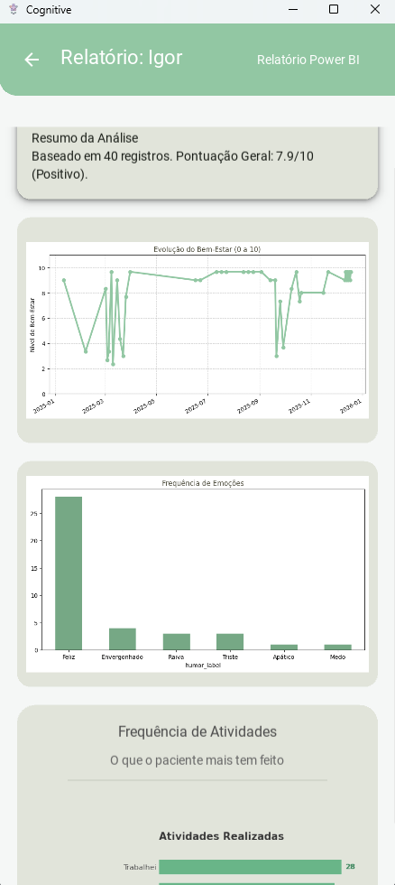
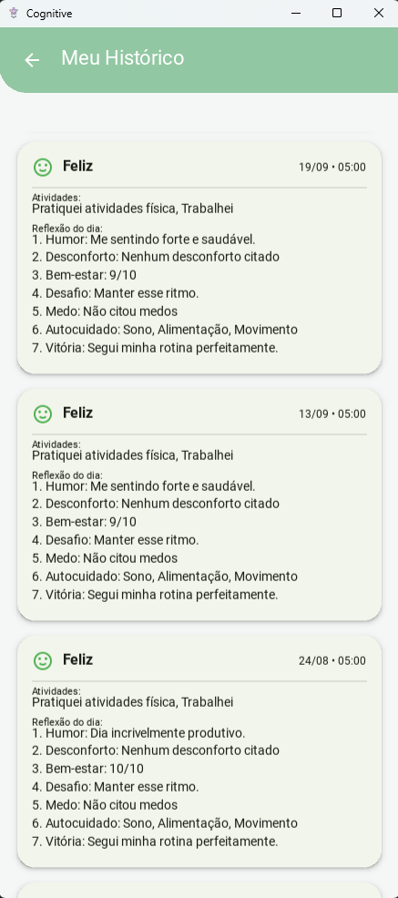

# Cognitive 🧠 - Plataforma de Acompanhamento Terapêutico

> Trabalho de Conclusão de Curso (TCC) - Bacharelado em Ciência da Computação

  

## 📌 Sobre o Projeto

O **Cognitive** é uma solução mobile integrada a uma API robusta, desenvolvida para auxiliar no processo de Terapia Cognitivo-Comportamental (TCC). O aplicativo preenche a lacuna de comunicação entre as sessões, permitindo que pacientes registrem seu humor e atividades diárias, enquanto psicólogos têm acesso a um dashboard com visualização de dados para apoiar o diagnóstico e o tratamento.

O sistema resolve a dificuldade de monitoramento contínuo do paciente, substituindo diários de papel por uma aplicação inteligente que gera gráficos de evolução clínica.

## 🚀 Funcionalidades Principais

### Para o Paciente (App Mobile)
* **Diário de Humor:** Registro diário de sentimentos e anotações.
* **Registro de Atividades:** Correlação entre atividades realizadas e estado emocional.
* **Interface Intuitiva:** Design moderno focado em usabilidade e acessibilidade.

### Para o Psicólogo (Dashboard)
* **Gestão de Pacientes:** Vínculo seguro através de códigos únicos gerados pela API.
* **Análise de Dados:**
    * Gráficos de evolução do bem-estar ao longo do tempo.
    * Análise de frequência de emoções e atividades.
    * Relatórios visuais gerados com **Matplotlib** e **Pandas**.
* **Agenda:** Controle de horários disponíveis e marcação de consultas.

## 🛠 Tecnologias Utilizadas

O projeto foi desenvolvido utilizando uma arquitetura Full Stack com Python:

**Mobile (Frontend):**
* **Python & Kivy:** Lógica da aplicação.
* **KivyMD:** Framework de UI seguindo as diretrizes do Material Design.
* **Requests:** Comunicação assíncrona com a API REST.

**Backend (API & Dados):**
* **FastAPI:** Framework de alta performance para construção da API REST.
* **PostgreSQL (Neon DB):** Banco de dados relacional na nuvem.
* **Pandas & Matplotlib:** Processamento de dados e geração de gráficos server-side.
* **Bcrypt:** Criptografia de senhas e segurança.

## 📱 Screenshots

| Tela Inicial (Psicólogo) | Relatório de Evolução | Diário do Paciente |
|:---:|:---:|:---:|
|  |  | 


## ⚙️ Como Executar

### Pré-requisitos
* Python 3.9+
* Conta no PostgreSQL (ou Docker local)

### Instalação

1. Clone o repositório:
```bash
git clone https://github.com/IgorMirand/TCC-Cognitive.git 
```
2. Instale as dependências:
```bash
pip install -r requirements.txt
```
3. Configure as variáveis de ambiente (.env):
```bash
NEON_DB_URL=sua_url_do_banco
SECRET_KEY=sua_chave_secreta
```
4. Execute a API:
```bash
uvicorn main:app --reload
```
5. Execute o App Mobile:
```bash
python main_app.py
```

## 📄 Licença
Este projeto está sob a licença MIT - veja o arquivo LICENSE.md para detalhes.

Desenvolvido por Igor Miranda Moura | Raiel Ferreira Araujo | Igor Nunes Araujo.
